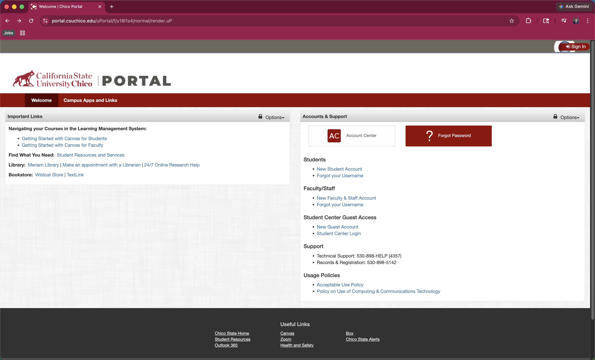
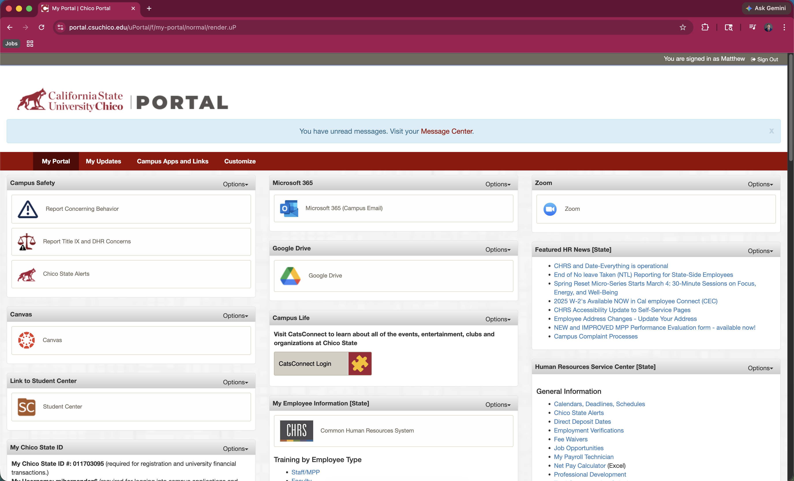
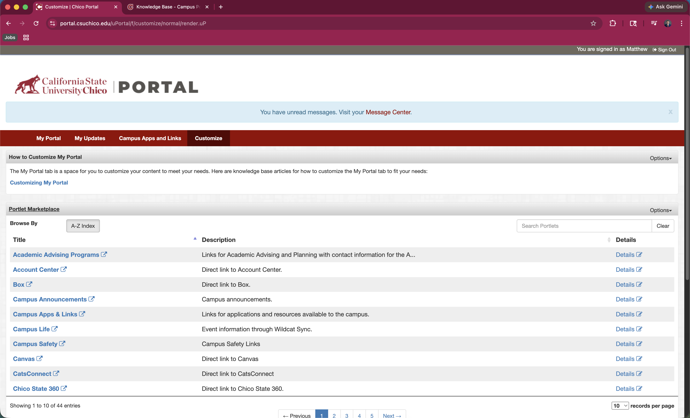
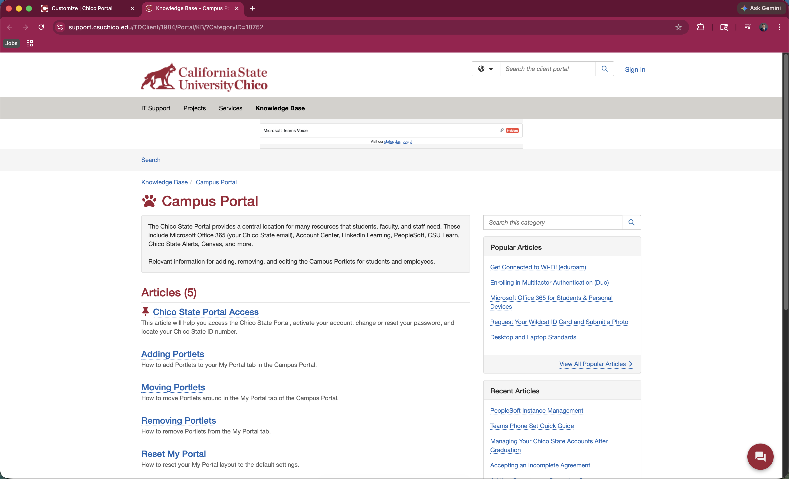
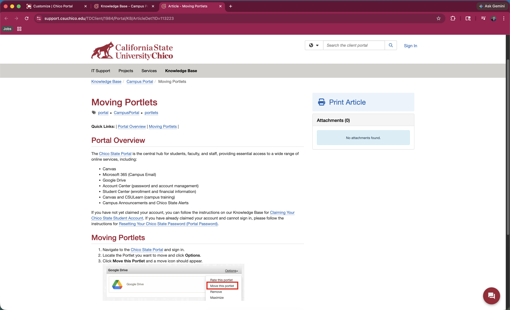
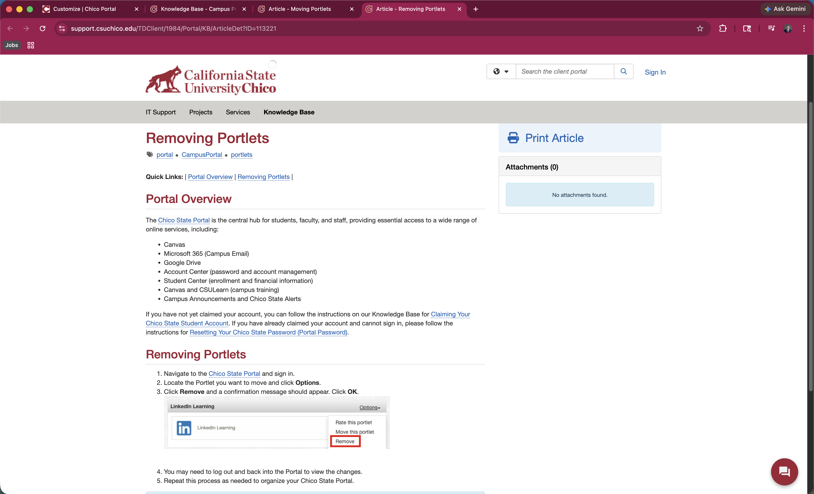
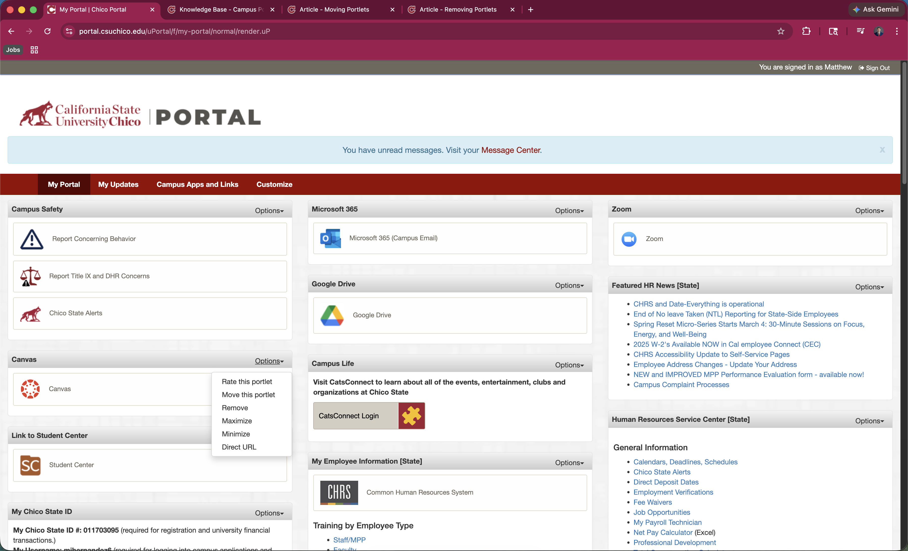
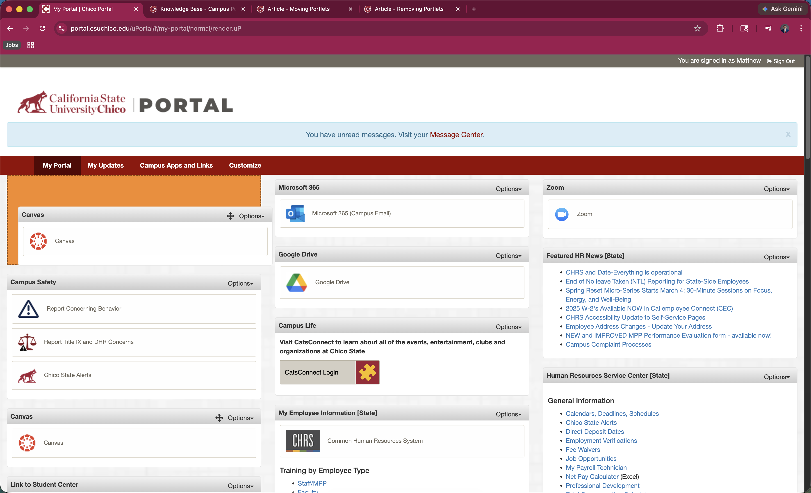

# Journal 1: A Walk Through the Chico State Portal
---
I went into the Chico State Portal with a simple goal to customize my Dashboard by moving and removing some of the widgets so it better fits how I actually use it. This post walks through exactly how I tried to do that, and what I was thinking while interacting with the interface.

I start on the Chico State homepage where I see the “Sign In” button in the top right.

This was straightforward because it matches my mental model, which is basically the expectation I have in my head based on using other websites. Most sites put login buttons in the top right, so I didn’t have to think about where to go.

After clicking it, I’m taken to the login page where I see two rectangles for my username and password.

These boxes are a good example of an affordance, which just means the design makes it obvious what I’m supposed to do. The boxes look like something I should type into, so I do. No confusion here.

Once I log in, I’m taken to the Dashboard.

At this point, I’m trying to figure out how to customize it, but nothing immediately stands out. I eventually notice a tab labeled “Customize,” which seems like exactly what I need, so I click it.

This is where things start to get frustrating. The “Customize” page doesn’t actually let me customize my Dashboard. Instead, it shows something more like a marketplace of “portlets,” and there’s a message telling me I need to go back to the main Dashboard to actually customize content. There’s also a link to a knowledge article explaining how to do it.

This feels misleading because based on my mental model, a button labeled “Customize” should let me customize things directly, not redirect me somewhere else.

I click the help article since I don’t really see another option. On that page, I see multiple links, so I choose the one about moving a portlet, which I assume means the widgets I was talking about.

This also introduces a bit of a disconnect because the system uses the word “portlet” instead of something more familiar like widget, so I have to mentally translate what that means.

From there, I read the instructions for moving and then go back and also read how to remove portlets.

After that, I go back to the Dashboard and start looking more carefully. I notice that each portlet has an “Options” dropdown button.

When I click it, I finally see options like move and remove.

When I click “Move,” a four-way arrow icon appears next to the portlet.

This is another example of an affordance because the arrow clearly suggests that I can drag the portlet around. When I actually start dragging it, I see a highlighted area showing where it will be placed if I drop it.

That feedback is helpful and makes the interaction feel more intuitive.

Finally, I try removing a portlet. I go to another one, open the dropdown, and click remove. A popup appears asking me to confirm that I want to remove it (insert screenshot of confirmation popup here). This makes sense because it prevents me from accidentally deleting something.

Overall, the actual actions like moving and removing portlets worked fine once I found them, but getting there was the confusing part. The biggest issue was that the “Customize” tab didn’t match what I expected it to do based on my mental model, and I had to rely on a help article just to figure out something that feels like it should be simple. The affordances within the actual dashboard, like the drag arrows and highlight areas, were clear and helpful, but they were kind of hidden behind menus that weren’t obvious at first.
